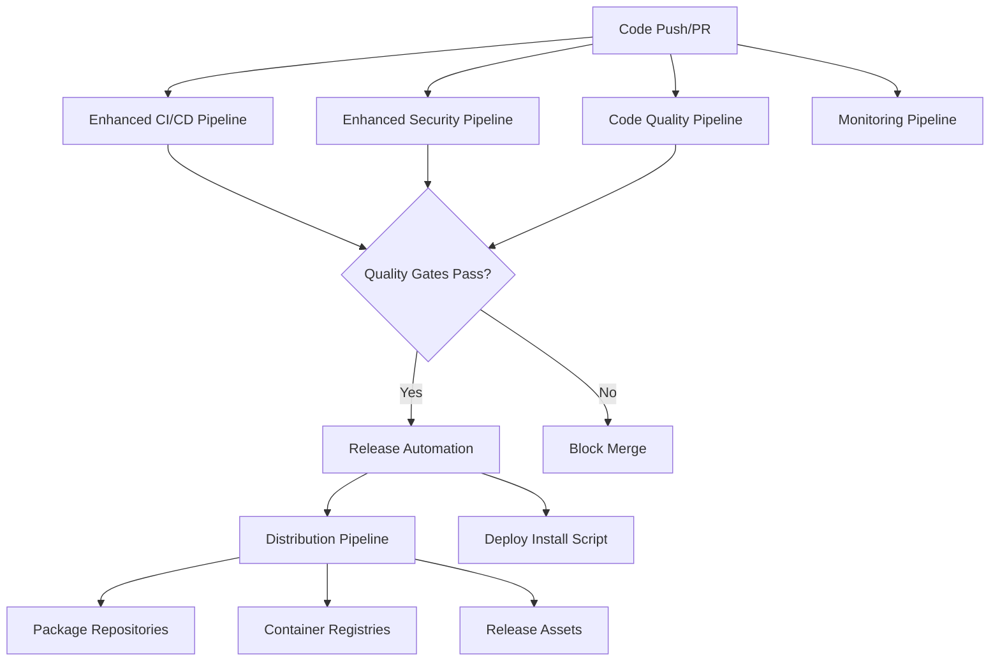
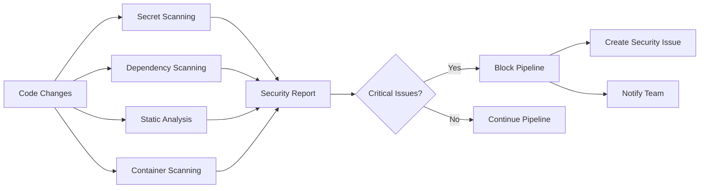

# GitHub Workflows Integration Guide

This document outlines how all GitHub workflows integrate to provide a comprehensive CI/CD and distribution pipeline for Tinel.

## 🔄 Workflow Architecture

### Core CI/CD Workflows



### Workflow Triggers and Dependencies

| Workflow | Triggers | Dependencies | Purpose |
|----------|----------|--------------|---------|
| **ci.yml** | Push, PR | None | Consolidated CI/CD with quality & security gates |
| **monitoring.yml** | Workflow completion, Schedule | All workflows | Health monitoring and alerting |
| **release.yml** | Tags, Manual | CI success | Release automation and PyPI deployment |
| **distribution.yml** | Release trigger, Manual | Release completion | Multi-platform package building |
| **deploy-install-script.yml** | Script changes | None | Installation website deployment |

## 🚀 Release Process Flow

### 1. Code Development
```bash
# Developer workflow
git checkout -b feature/new-feature
# Make changes
git commit -m "feat: add new feature"
git push origin feature/new-feature
# Create PR
```

**Triggered Workflows:**
- ✅ CI Pipeline (quality & security gates, all Python versions)

### 2. Pull Request Review
- **Automated Checks**: All workflows must pass
- **Security Gates**: No critical vulnerabilities
- **Quality Gates**: 100% test coverage required
- **Manual Review**: 2 approvals required for main branch

### 3. Merge to Main
```bash
git checkout main
git merge feature/new-feature
git push origin main
```

**Triggered Workflows:**
- ✅ All CI workflows (validation)
- ✅ Monitoring workflow (health check)

### 4. Release Creation
```bash
# Automatic (on tag push)
git tag v1.2.3
git push origin v1.2.3

# Manual (workflow dispatch)
# Go to Actions → Release Automation → Run workflow
```

**Release Workflow Steps:**
1. **Pre-release Validation**
   - Run full test suite
   - Security scanning
   - Version validation
   - Changelog generation

2. **Build Release Artifacts**
   - Python wheels and source distribution
   - SBOM generation
   - Artifact signing with Sigstore
   - Installation testing

3. **GitHub Release Creation**
   - Create Git tag (if manual)
   - Upload release assets
   - Generate release notes

4. **PyPI Deployment**
   - Publish to PyPI
   - Verify deployment

5. **Trigger Distribution**
   - Automatically trigger distribution workflow
   - Build all package types

### 5. Distribution Building
**Distribution Workflow Jobs:**
1. **System Packages**: DEB and RPM packages
2. **Container Images**: Docker images (Ubuntu, Alpine, Distroless)
3. **Binary Distributions**: PyInstaller executables
4. **Universal Packages**: Snap and Flatpak packages
5. **Package Publishing**: Upload to repositories and stores

### 6. Installation Script Deployment
**Auto-triggered on script changes:**
- Deploy to GitHub Pages at `https://install.tinel.dev`
- Update documentation with correct URLs
- Verify deployment accessibility

## 🔒 Security Integration

### Security Scanning Pipeline


### Security Tools Integration
- **GitLeaks**: Secret detection in commits
- **TruffleHog**: Historical secret scanning
- **Safety**: Python dependency vulnerabilities
- **pip-audit**: OSV database scanning
- **Bandit**: Python code security analysis
- **Semgrep**: Advanced static analysis
- **CodeQL**: Semantic code analysis
- **Trivy**: Container vulnerability scanning

## 📊 Quality Assurance

### Quality Gates
1. **Code Coverage**: 100% requirement (enforced)
2. **Linting**: Ruff and Black compliance
3. **Type Checking**: MyPy validation
4. **Security**: No critical/high vulnerabilities
5. **Dependencies**: Up-to-date and secure
6. **Documentation**: Complete docstring coverage

### Quality Metrics Collection
- **Success Rate Tracking**: Workflow reliability metrics
- **Performance Monitoring**: Build time and resource usage
- **Failure Analysis**: Automatic pattern detection
- **Coverage Trends**: Historical coverage tracking

## 🔧 Workflow Configuration

### Required Secrets
```yaml
# Repository Secrets (Settings → Secrets and variables → Actions)
CODECOV_TOKEN:          # Codecov integration
PYPI_API_TOKEN:         # PyPI publishing
DOCKER_USERNAME:        # Docker Hub publishing
DOCKER_PASSWORD:        # Docker Hub publishing
SNAPCRAFT_TOKEN:        # Snap Store publishing
SLACK_WEBHOOK_URL:      # Monitoring notifications (optional)
TEAMS_WEBHOOK_URL:      # Monitoring notifications (optional)
GITLEAKS_LICENSE:       # GitLeaks Pro (optional)
SEMGREP_APP_TOKEN:      # Semgrep App (optional)
```

### Environment Configuration
```yaml
# Repository Environments (Settings → Environments)
pypi:
  protection_rules:
    - required_reviewers: ["maintainer-team"]
    - prevent_self_review: true
  secrets:
    - PYPI_API_TOKEN

github-pages:
  protection_rules: []
  deployment_branch_policy: main_only
```

### Branch Protection Rules
```yaml
# Main Branch Protection (Settings → Branches)
required_status_checks:
  - "Quality & Security Gates (Python 3.11)"
  - "Quality & Security Gates (Python 3.12)" 
  - "Quality & Security Gates (Python 3.13)"
  - "Build & Integration Tests"
  - "CI Summary"

required_reviews:
  count: 2
  dismiss_stale: true
  require_code_owner_reviews: true

restrictions:
  push_allowlist: []
  force_push: false
  deletion: false
```

## 📦 Distribution Integration

### Package Building Matrix
| Package Type | Platforms | Auto-Publish | Storage |
|--------------|-----------|--------------|---------|
| **PyPI** | All | ✅ Yes | PyPI.org |
| **Docker** | AMD64, ARM64 | ✅ Yes | Docker Hub, GHCR |
| **DEB** | AMD64, ARM64 | ❌ Manual | GitHub Releases |
| **RPM** | AMD64, ARM64 | ❌ Manual | GitHub Releases |
| **Snap** | AMD64, ARM64 | ✅ Yes | Snap Store |
| **Flatpak** | AMD64, ARM64 | ❌ Manual | Flathub (PR required) |
| **Binary** | AMD64, ARM64 | ❌ Manual | GitHub Releases |

### Installation Method Priorities
1. **Install Script** (`curl -sSL https://install.tinel.dev | bash`)
2. **PyPI** (`pip install tinel`)
3. **System Packages** (DEB/RPM from releases)
4. **Docker** (`docker run tinel/tinel:latest`)
5. **Universal Packages** (Snap, Flatpak)
6. **Binary Downloads** (Portable executables)

## 🔄 Continuous Integration

### Workflow Health Monitoring
- **Daily Health Checks**: Automated workflow reliability assessment
- **Failure Pattern Detection**: Automatic issue creation for degraded performance
- **Performance Metrics**: Build time and resource usage tracking
- **Alerting**: Slack/Teams notifications for critical failures

### Automatic Maintenance
- **Dependency Updates**: Dependabot automated PRs
- **Security Updates**: Priority handling of vulnerability fixes
- **Workflow Updates**: Version updates for GitHub Actions
- **Cache Management**: Automatic cleanup and optimization

## 🎯 Best Practices

### Development Workflow
1. **Feature Branches**: Always use feature branches for development
2. **Small PRs**: Keep pull requests focused and reviewable
3. **Test First**: Write tests before implementing features
4. **Security Focus**: Consider security implications of changes
5. **Documentation**: Update docs with significant changes

### Release Management
1. **Semantic Versioning**: Follow semver for all releases
2. **Changelog**: Maintain comprehensive changelog
3. **Testing**: Thoroughly test release candidates
4. **Rollback Plan**: Have rollback procedures ready
5. **Communication**: Announce releases to users

### Monitoring and Maintenance
1. **Regular Reviews**: Monthly workflow performance reviews
2. **Security Audits**: Quarterly security posture assessments
3. **Dependency Updates**: Weekly dependency review and updates
4. **Documentation**: Keep workflow documentation current
5. **Training**: Ensure team understands CI/CD processes

## 🛠️ Troubleshooting

### Common Issues

#### Workflow Failures
```bash
# Check workflow status
gh run list --workflow="Enhanced CI/CD Pipeline"

# View failed run details
gh run view <run-id> --log

# Re-run failed jobs
gh run rerun <run-id> --failed
```

#### Security Scan Failures
```bash
# Check security reports
gh run download <run-id> --pattern "*security*"

# Review vulnerability details
cat vulnerability-reports/safety-report.json | jq .
```

#### Distribution Build Failures
```bash
# Check distribution workflow
gh run list --workflow="Package Distribution"

# Download build artifacts
gh run download <run-id> --pattern "*package*"
```

### Getting Help
- **Workflow Issues**: Check GitHub Actions documentation
- **Security Issues**: Review security playbook (`.github/SECURITY_PLAYBOOK.md`)
- **Distribution Issues**: Check package-specific documentation
- **General Issues**: Create issue in repository

---

This integration ensures **reliable, secure, and comprehensive** software delivery for Tinel across all supported Linux distributions and installation methods.