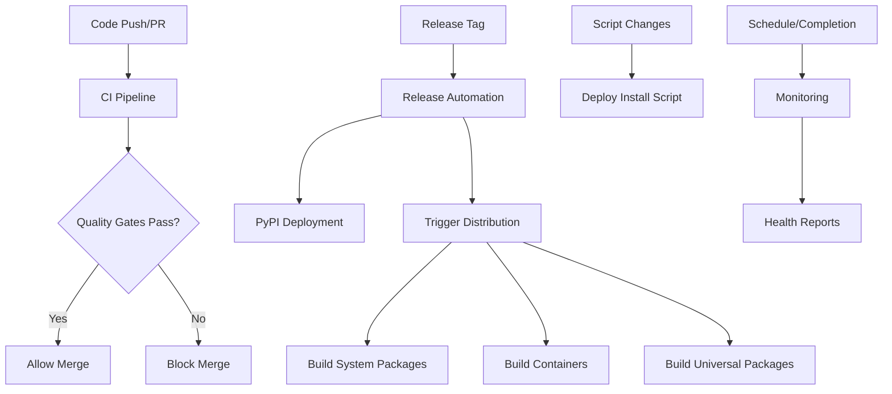

# GitHub Workflows Documentation

This directory contains the complete CI/CD and distribution pipeline for Tinel. The workflows are designed for enterprise-grade quality, security, and reliability.

## 🏗️ Workflow Overview

### Core Workflows

1. **`ci.yml`** - **Consolidated CI/CD Pipeline**
   - Quality gates (linting, formatting, type checking)
   - Security scanning (dependency vulnerabilities, static analysis)
   - Testing with 100% coverage enforcement
   - Build verification and integration tests
   - Documentation generation (when needed)
   - Parallel execution for optimal performance

2. **`release.yml`** - **Release Automation**
   - Pre-release validation and testing
   - Automated version management
   - GitHub release creation
   - PyPI deployment with verification
   - SBOM generation and artifact signing
   - Distribution workflow triggering

3. **`distribution.yml`** - **Multi-Platform Package Distribution**
   - System packages (DEB, RPM)
   - Container images (Docker - Ubuntu, Alpine, Distroless)
   - Universal packages (Snap, Flatpak)
   - Binary distributions (PyInstaller)
   - Package repository publishing

4. **`deploy-install-script.yml`** - **Installation Website**
   - GitHub Pages deployment for installation scripts
   - Automated installation URL updates
   - Website verification and monitoring

5. **`monitoring.yml`** - **Workflow Health Monitoring**
   - Daily workflow health checks
   - Failure pattern detection
   - Performance metrics tracking
   - Automated alerting and issue creation

6. **`dependency-update.yml`** - **Automated Maintenance**
   - Daily dependency updates via Dependabot
   - Security vulnerability patching
   - Automated testing of updates

## 🔄 Workflow Integration



## 🎯 Quality Gates

### Required for All PRs
- **100% Test Coverage**: Enforced across all Python versions (3.11, 3.12, 3.13)
- **Code Quality**: Ruff linting, Black formatting, MyPy type checking
- **Security Scanning**: Dependency vulnerabilities (Safety), static analysis (Bandit)
- **Build Verification**: Package build and installation testing

### Release Requirements
- All CI checks pass
- Security scans show no critical issues
- Full integration test suite passes
- Documentation is up to date

## 🔒 Security Features

### Continuous Security
- **Secret Scanning**: GitLeaks and TruffleHog for exposed secrets
- **Dependency Analysis**: Safety and pip-audit for known vulnerabilities
- **Static Code Analysis**: Bandit for Python security patterns
- **Container Scanning**: Trivy for container image vulnerabilities

### Supply Chain Security
- **SBOM Generation**: Software Bill of Materials for all releases
- **Artifact Signing**: Sigstore keyless signing for release artifacts
- **Provenance**: Full build provenance tracking
- **Security Hardening**: Step Security hardening for all workflows

## 📦 Distribution Strategy

### Primary Installation Methods
1. **Install Script**: `curl -sSL https://install.tinel.dev | bash`
2. **PyPI**: `pip install tinel`
3. **System Packages**: DEB/RPM from GitHub releases
4. **Docker**: `docker run tinel/tinel:latest`

### Universal Packages
- **Snap Store**: `snap install tinel`
- **Flatpak**: Available for manual installation
- **Homebrew**: Coming soon
- **Binary**: Portable executables for offline installation

## ⚙️ Configuration

### Required Repository Secrets
```yaml
CODECOV_TOKEN:          # Code coverage reporting
PYPI_API_TOKEN:         # PyPI package publishing
DOCKER_USERNAME:        # Docker Hub publishing
DOCKER_PASSWORD:        # Docker Hub publishing
SNAPCRAFT_TOKEN:        # Snap Store publishing
SLACK_WEBHOOK_URL:      # Monitoring notifications (optional)
TEAMS_WEBHOOK_URL:      # Monitoring notifications (optional)
```

### Required Repository Environments
- **`pypi`**: For PyPI deployment with approval gates
- **`github-pages`**: For installation website deployment

### Branch Protection Requirements
- 2 required reviewers for main branch
- All status checks must pass:
  - "Quality & Security Gates (Python 3.11)"
  - "Quality & Security Gates (Python 3.12)"
  - "Quality & Security Gates (Python 3.13)"
  - "Build & Integration Tests"
  - "CI Summary"

## 🚀 Usage Examples

### Development Workflow
```bash
# Create feature branch
git checkout -b feature/new-feature

# Make changes and push
git add .
git commit -m "feat: implement new feature"
git push origin feature/new-feature

# Create PR - all workflows automatically trigger
# Merge after approval and all checks pass
```

### Release Workflow
```bash
# Automatic release on tag
git tag v1.2.3
git push origin v1.2.3

# Manual release via GitHub Actions UI
# Go to Actions → Release Automation → Run workflow
```

### Distribution Monitoring
```bash
# Check workflow status
gh run list --workflow="CI Pipeline"

# View failed run details  
gh run view <run-id> --log

# Download build artifacts
gh run download <run-id>
```

## 🛠️ Maintenance

### Workflow Updates
- Workflows automatically update dependencies
- Security patches are applied via Dependabot
- Manual review required for major version changes

### Performance Optimization
- Comprehensive caching strategy reduces build times
- Parallel execution maximizes throughput
- Conditional jobs minimize unnecessary work

### Monitoring and Alerts
- Daily health checks ensure workflow reliability
- Automatic issue creation for degraded performance
- Configurable alerting via Slack/Teams webhooks

## 📚 Additional Resources

- **Security Playbook**: `.github/SECURITY_PLAYBOOK.md`
- **Integration Guide**: `.github/WORKFLOW_INTEGRATION.md`
- **Distribution Strategy**: `DISTRIBUTION_STRATEGY.md`
- **Installation Guide**: `INSTALLATION.md`

---

This workflow architecture ensures **reliable, secure, and comprehensive** software delivery for Tinel across all supported Linux distributions and installation methods.