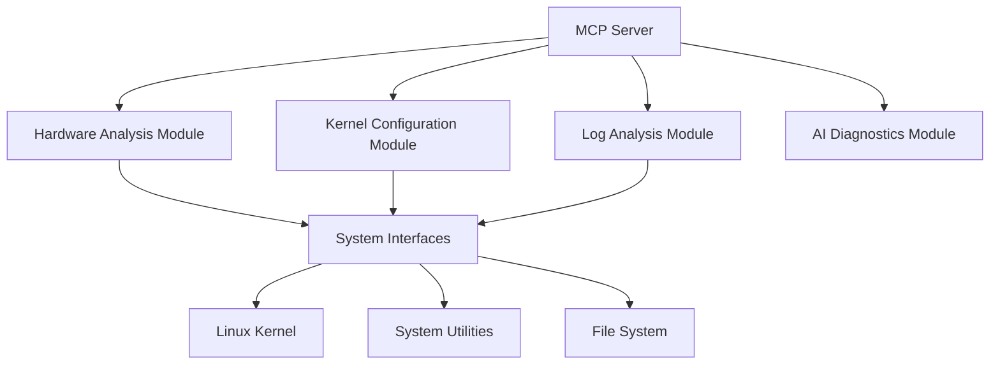
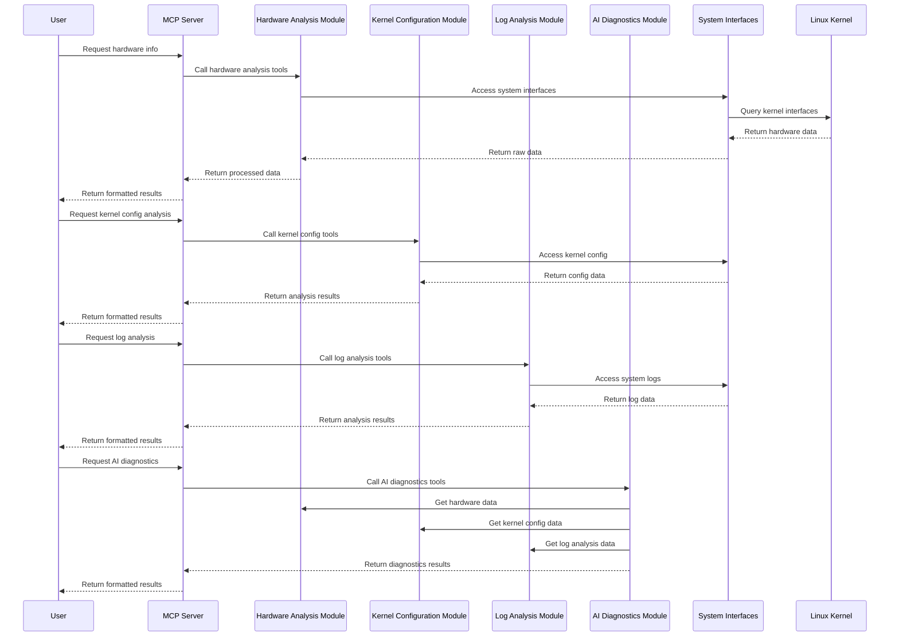

# Design Document: Infenix Hardware and Kernel Intelligence

## Overview

Infenix is a Linux hardware and kernel intelligence tool designed to provide comprehensive system analysis, optimization, and diagnostics capabilities. The tool leverages the Linux kernel interfaces and system utilities to gather detailed hardware information, analyze kernel configurations, parse system logs, and provide intelligent diagnostics through an AI-powered MCP (Model Context Protocol) server.

This design document outlines the architecture, components, interfaces, data models, error handling, and testing strategy for the Infenix tool. The design builds upon the existing hardware information gathering capabilities and extends them to include kernel configuration analysis, system log parsing, and AI-powered diagnostics.

## Architecture

The Infenix system follows a modular architecture with the following high-level components:



### Core Components

1. **MCP Server**: The central component that exposes tools for hardware information, kernel configuration analysis, log analysis, and AI-powered diagnostics.
2. **Hardware Analysis Module**: Gathers detailed hardware information from various system interfaces and utilities.
3. **Kernel Configuration Module**: Analyzes kernel configuration for optimization and security.
4. **Log Analysis Module**: Parses and analyzes system logs for patterns and issues.
5. **AI Diagnostics Module**: Provides intelligent diagnostics and recommendations based on gathered data.
6. **System Interfaces**: Interfaces with the Linux kernel, system utilities, and file system to gather data.

### Data Flow



## Components and Interfaces

### 1. MCP Server

The MCP server is the main entry point for the Infenix tool. It exposes tools for hardware information, kernel configuration analysis, log analysis, and AI-powered diagnostics.

**Key Responsibilities:**

- Register and expose tools for hardware information, kernel configuration, log analysis, and AI diagnostics
- Handle tool calls and route them to the appropriate modules
- Format and return results to the client
- Handle errors and provide meaningful error messages

**Interface:**

- `list_tools()`: Lists available tools
- `call_tool(request)`: Handles tool calls and returns results

### 2. Hardware Analysis Module

The Hardware Analysis Module gathers detailed hardware information from various system interfaces and utilities. This module is already implemented in the existing codebase and will be extended to provide more comprehensive hardware information.

**Key Responsibilities:**

- Gather CPU information (model, cores, frequency, features)
- Gather memory information (RAM size, type, configuration)
- Gather storage information (disks, partitions, filesystem usage)
- Gather PCI device information
- Gather USB device information
- Gather network interface information
- Gather graphics hardware information

**Interface:**

- `get_cpu_info()`: Gets detailed CPU information
- `get_memory_info()`: Gets detailed memory information
- `get_storage_info()`: Gets detailed storage information
- `get_pci_devices()`: Gets PCI device information
- `get_usb_devices()`: Gets USB device information
- `get_network_info()`: Gets network hardware information
- `get_graphics_info()`: Gets graphics hardware information
- `get_all_hardware_info()`: Gets comprehensive hardware information

### 3. Kernel Configuration Module

The Kernel Configuration Module analyzes kernel configuration for optimization and security. This module will be newly implemented.

**Key Responsibilities:**

- Read and parse kernel configuration
- Identify suboptimal or potentially problematic configuration options
- Recommend optimizations based on detected hardware
- Check for security-related configuration options
- Compare current configuration against best practices

**Interface:**

- `get_kernel_config()`: Gets current kernel configuration
- `analyze_kernel_config()`: Analyzes kernel configuration for optimization and security
- `get_kernel_optimization_recommendations()`: Gets optimization recommendations based on hardware and configuration

### 4. Log Analysis Module

The Log Analysis Module parses and analyzes system logs for patterns and issues. This module will be newly implemented.

**Key Responsibilities:**

- Parse standard system logs (kernel, system, application)
- Identify patterns indicating hardware issues
- Identify patterns indicating kernel issues
- Correlate log entries with hardware events
- Provide a summary of critical issues found

**Interface:**

- `get_system_logs()`: Gets system logs
- `analyze_logs()`: Analyzes logs for patterns and issues
- `get_log_summary()`: Gets a summary of critical issues found in logs

### 5. AI Diagnostics Module

The AI Diagnostics Module provides intelligent diagnostics and recommendations based on gathered data. This module will be newly implemented.

**Key Responsibilities:**

- Interpret natural language queries
- Execute appropriate tools based on queries
- Provide human-readable explanations and insights
- Provide actionable recommendations
- Maintain context for follow-up questions

**Interface:**

- `diagnose_system()`: Diagnoses system based on hardware, kernel configuration, and logs
- `get_recommendations()`: Gets actionable recommendations based on diagnostics
- `answer_query(query)`: Answers natural language queries about the system

### 6. System Interfaces

The System Interfaces component interfaces with the Linux kernel, system utilities, and file system to gather data. This component is already partially implemented in the existing codebase and will be extended to support new modules.

**Key Responsibilities:**

- Execute system commands and handle errors
- Read files from the file system
- Parse command output and file contents
- Handle permissions and access control

**Interface:**

- `run_command(cmd)`: Runs a system command and returns the result
- `read_sys_file(path)`: Reads a file from the file system
- `parse_command_output(output, format)`: Parses command output in various formats

## Data Models

### 1. Hardware Information Model

```python
class HardwareInfo:
    """Model for hardware information."""

    cpu: Dict[str, Any]  # CPU information
    memory: Dict[str, Any]  # Memory information
    storage: Dict[str, Any]  # Storage information
    pci_devices: Dict[str, Any]  # PCI device information
    usb_devices: Dict[str, Any]  # USB device information
    network: Dict[str, Any]  # Network hardware information
    graphics: Dict[str, Any]  # Graphics hardware information
```

### 2. Kernel Configuration Model

```python
class KernelConfigOption:
    """Model for a kernel configuration option."""

    name: str  # Option name
    value: str  # Option value
    description: str  # Option description
    recommended: Optional[str]  # Recommended value
    security_impact: Optional[str]  # Security impact
    performance_impact: Optional[str]  # Performance impact

class KernelConfig:
    """Model for kernel configuration."""

    version: str  # Kernel version
    options: Dict[str, KernelConfigOption]  # Configuration options
    analysis: Dict[str, Any]  # Analysis results
    recommendations: Dict[str, Any]  # Recommendations
```

### 3. Log Entry Model

```python
class LogEntry:
    """Model for a log entry."""

    timestamp: datetime  # Entry timestamp
    facility: str  # Log facility
    severity: str  # Log severity
    message: str  # Log message
    source: str  # Log source

class LogAnalysis:
    """Model for log analysis results."""

    entries: List[LogEntry]  # Log entries
    patterns: Dict[str, Any]  # Identified patterns
    issues: Dict[str, Any]  # Identified issues
    summary: Dict[str, Any]  # Summary of critical issues
```

### 4. Diagnostic Model

```python
class Diagnostic:
    """Model for system diagnostics."""

    hardware: HardwareInfo  # Hardware information
    kernel_config: Optional[KernelConfig]  # Kernel configuration
    log_analysis: Optional[LogAnalysis]  # Log analysis
    recommendations: Dict[str, Any]  # Recommendations
    explanation: str  # Human-readable explanation
```

## Error Handling

The Infenix tool will implement a comprehensive error handling strategy to ensure robustness and reliability. The strategy includes:

1. **Graceful Degradation**: If a specific data source is unavailable or fails, the tool will continue with available data sources and provide partial results.

2. **Detailed Error Reporting**: The tool will provide detailed error messages that include the specific error, the component that failed, and possible remediation steps.

3. **Permission Handling**: The tool will handle permission errors gracefully, informing the user when elevated privileges are required and providing instructions on how to grant them.

4. **Timeout Handling**: The tool will implement timeouts for system commands and file operations to prevent hanging or blocking.

5. **Input Validation**: The tool will validate all inputs to prevent security vulnerabilities and ensure correct operation.

6. **Exception Handling**: The tool will catch and handle exceptions at appropriate levels to prevent crashes and provide meaningful error messages.

7. **Logging**: The tool will log errors and warnings for debugging and troubleshooting.

## Testing Strategy

The Infenix tool will implement a comprehensive testing strategy to ensure quality and reliability. The strategy includes:

1. **Unit Testing**: Each component and function will have unit tests to verify correct behavior in isolation.

2. **Integration Testing**: Integration tests will verify that components work together correctly.

3. **System Testing**: System tests will verify that the entire system works correctly in a real environment.

4. **Mock Testing**: Mock objects will be used to simulate system interfaces and utilities for testing in isolation.

5. **Error Handling Testing**: Tests will verify that the tool handles errors gracefully and provides meaningful error messages.

6. **Performance Testing**: Tests will verify that the tool performs efficiently and does not consume excessive resources.

7. **Security Testing**: Tests will verify that the tool follows security best practices and does not introduce vulnerabilities.

8. **Code Coverage**: The tool will aim for 100% code coverage for critical components and at least 90% overall code coverage.

### Test Types

1. **Unit Tests**: Test individual functions and methods in isolation.
2. **Integration Tests**: Test interactions between components.
3. **System Tests**: Test the entire system in a real environment.
4. **Mock Tests**: Test with simulated system interfaces and utilities.
5. **Error Handling Tests**: Test error handling and recovery.
6. **Performance Tests**: Test resource usage and performance.
7. **Security Tests**: Test for security vulnerabilities.

### Test Tools

1. **pytest**: Main testing framework
2. **pytest-cov**: Code coverage measurement
3. **unittest.mock**: Mocking framework
4. **bandit**: Security testing
5. **safety**: Dependency security checking

### Test Execution

Tests will be executed:

1. Locally during development
2. In CI/CD pipelines for pull requests and merges
3. Nightly for comprehensive testing

### Test Coverage Goals

1. 100% code coverage for critical components
2. At least 90% overall code coverage
3. All error handling paths tested
4. All public interfaces tested

## Conclusion

This design document outlines the architecture, components, interfaces, data models, error handling, and testing strategy for the Infenix tool. The design builds upon the existing hardware information gathering capabilities and extends them to include kernel configuration analysis, system log parsing, and AI-powered diagnostics.

The modular architecture allows for easy extension and maintenance, while the comprehensive error handling and testing strategies ensure robustness and reliability. The tool will provide valuable insights into Linux systems and help users optimize and troubleshoot their systems effectively.
